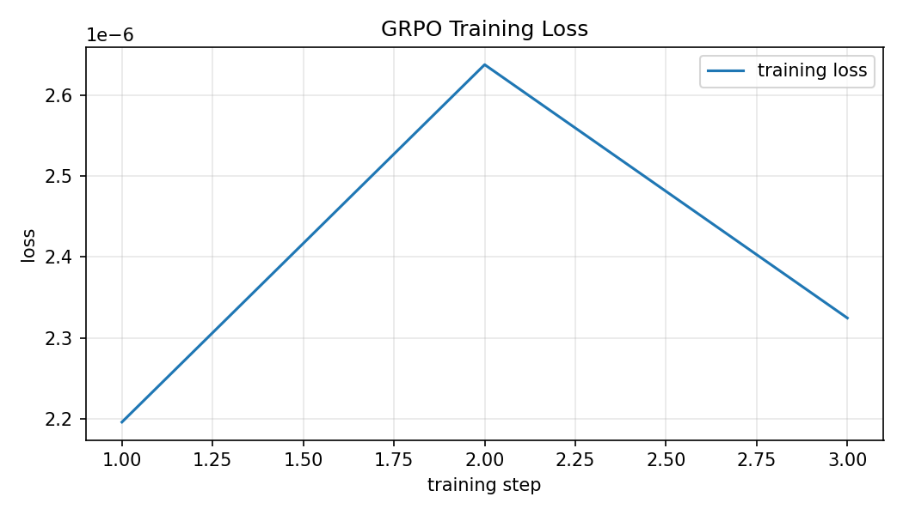
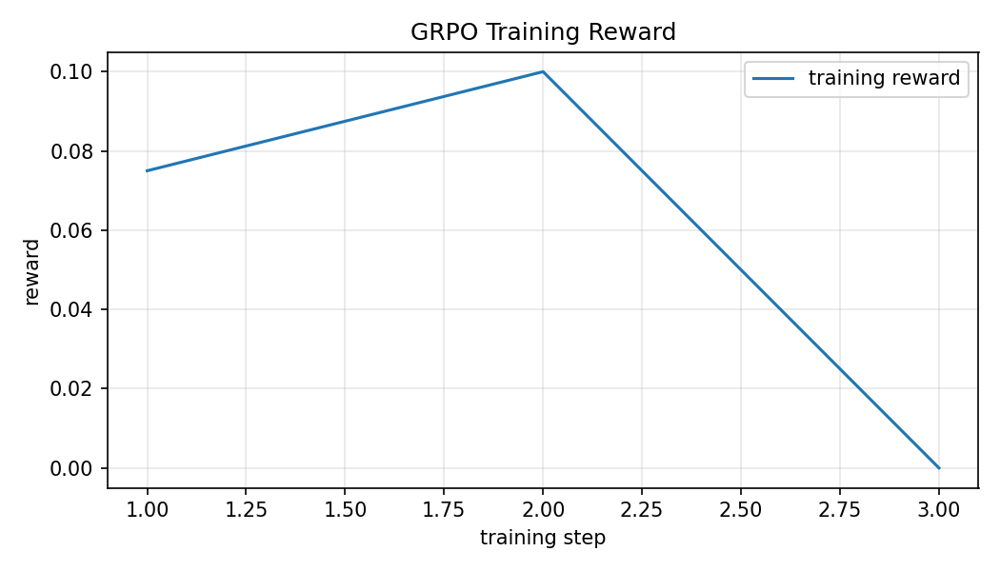
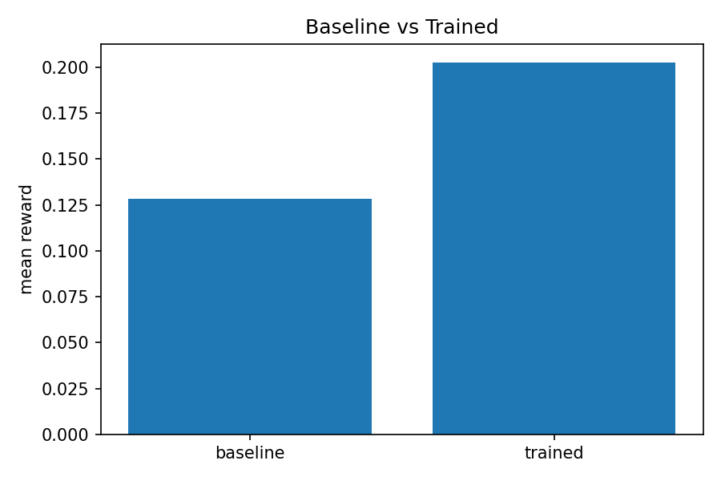

# Long-Horizon Multi-Agent Drug Discovery (OpenEnv)

A simulated 50-step drug discovery campaign for training LLM agents with GRPO.
Built on [OpenEnv](https://github.com/huggingface/openenv) for the **OpenEnv
Hackathon (India 2026)**. Targets four hackathon themes simultaneously:

- **#2 Long-Horizon Planning** (primary): 50 steps, sparse terminal reward.
- **#3.1 World Modeling**: tool use over RDKit-backed cheminformatics simulators
  + a pathway-graph topology engine for off-target risk propagation.
- **#1 Multi-Agent Interactions**: a Project Lead LLM advised by 4 rule-based
  sub-agents (Chemist, Toxicologist, Budget Manager, Oversight).
- **Fleet AI bonus & Mercor bonus**: oversight-compliance penalty + reasoning-trace
  depth scoring.

> Nothing in this environment is real chemistry. RDKit + a small ChEMBL-like
> compound library produce plausible feedback so the agent can learn systematic
> scientific reasoning under resource constraints.

## Links (judge-facing)

- Hugging Face Space: _add after `openenv push`_
- Mini blog post (writeup): _add HF blog post link_
- Demo video (<2 min): _add YouTube link — do not commit binary_
- WandB run (optional): _add link_

## What the agent does

The Project Lead drives a research campaign through 5 stages and at each step
chooses one tool call:

| Stage | Goal | Typical tools |
|-------|------|---------------|
| `target_selection` | Pick a protein target for the disease | `select_target`, `search_literature`, `advance_stage` |
| `hit_id` | Find candidate compounds | `search_compounds`, `predict_affinity` |
| `hit_to_lead` | Modify hits for better potency | `modify_molecule`, `predict_affinity` |
| `admet` | Filter for drug-likeness / toxicity | `evaluate_admet` |
| `lead_validation` | Final docking and lead nomination | `validate_compound`, `advance_stage` |

Each tool call costs budget (modulated by information-gain, uncertainty, and
late-stage redundancy multipliers). Sub-agents review every step and may emit
`info` / `warn` / `block` messages. **Ignoring a `block` warning incurs an
oversight penalty.**

The full tool inventory (13): `select_target`, `search_compounds`,
`predict_affinity`, `evaluate_admet`, `modify_molecule`, `synthesize`,
`validate_compound`, `search_literature`, `advance_stage`, `abandon_compound`,
`pause_and_review_all`, `delegate_to_subagent`, `request_subagent_summary`.

## Reward — composable rubric (7 components)

| Component | Range | Targets |
|-----------|-------|---------|
| `terminal_compound` | 0..1 | binding × ADMET × novelty of the nominated lead — **hard hERG/PAINS floor** |
| `stage_progression` | 0..1 | cleared canonical stages without skipping |
| `budget_efficiency` | 0..1 | budget remaining at the end |
| `reasoning_depth` | 0..1 | substantive scientific reasoning per step (Mercor) |
| `process` | 0..1 | per-step info-gain / cost efficiency |
| `strategy` | 0..1 | compound diversity + recovery from failure |
| `oversight_penalty` | -1..0 | for ignoring `block` warnings (Fleet AI) |

Components are coupled to *different* dimensions of behaviour, so an agent
can't max one component without losing on another (e.g. high reasoning depth
on a toxic compound still scores zero on terminal — the hERG/PAINS floor zeroes
the entire terminal reward).

Weights live in [`config/defaults.yaml`](config/defaults.yaml); `RewardEngine`
sums them into the final score.

## Architecture

```
.
├── pyproject.toml                  # package config, optional [training] / [test] / [chem] extras
├── openenv.yaml                    # OpenEnv manifest
├── config/defaults.yaml            # all tool costs, budget multipliers, reward weights
│
├── drug_discovery_env/             # Main package
│   ├── core/
│   │   ├── models.py               # Action / Observation / State / RewardBreakdown
│   │   ├── state.py                # GameState (compound ledger, budget, oversight bookkeeping)
│   │   ├── action_parser.py        # JSON-first / XML-tag fallback parser
│   │   ├── stage_manager.py        # Gate checker for agent-driven advance_stage
│   │   ├── budget_manager.py       # Variable-cost multipliers
│   │   ├── topology.py             # Pathway-graph BFS + risk propagation
│   │   ├── scenarios.py            # 15 disease/target seeds (with difficulty)
│   │   └── serializer.py           # Compact text rendering for LLM prompt
│   ├── tools/                      # 13 OpenEnv-MCP tools, one class per file
│   ├── agents/                     # Chemist / Toxicologist / Budget / Oversight
│   ├── rewards/                    # 7 components + aggregator
│   ├── chemistry/rdkit_lab.py      # RDKit-backed simulators (with deterministic fallback)
│   ├── retrieval/                  # BM25 + dense + cross-encoder hybrid retriever
│   ├── data_provider/              # live (Open Targets / ChEMBL / PubMed) + local + hybrid w/ circuit breaker
│   ├── data/                       # local snapshots + SHA256 manifest
│   ├── server/                     # FastAPI app, env, OpenEnv adapter
│   ├── client.py                   # typed HTTP/WS client (EnvClient subclass)
│   ├── training/                   # rollout generator, GRPO trainer, reward wrapper
│   └── scripts/                    # CLI entrypoints (baseline, eval, GRPO, live training, snapshots)
│
├── tests/                          # 14 pytest files (env, rewards, retrieval, data, training, manifest, …)
├── notebooks/02_train_grpo_colab.ipynb
└── artifacts/training/             # loss / reward / baseline-vs-trained PNGs + summary JSON
```

## Run locally

### 1. Install

```bash
python -m venv .venv && source .venv/bin/activate
pip install -e .[training,test]
```

For NVIDIA CUDA torch wheels (Linux):
```bash
python -m drug_discovery_env.scripts.setup_training_env --cuda
```
For macOS / CPU:
```bash
python -m drug_discovery_env.scripts.setup_training_env
```

### 2. Validate snapshots + run tests

```bash
python -m drug_discovery_env.scripts.prepare_snapshots
pytest -q
```

### 3. Smoke test the env

```bash
python -m drug_discovery_env.scripts.run_local_rollout --data-mode hybrid
python -m drug_discovery_env.scripts.run_evaluation --episodes 5 --data-mode hybrid
```

### 4. Run the random-policy baseline

```bash
python -m drug_discovery_env.scripts.run_baseline --episodes 10
```
Writes `outputs/baseline/baseline_summaries.json` — this is the floor that GRPO has to beat.

### 5. Start the FastAPI env server

```bash
uvicorn drug_discovery_env.server.app:app --host 0.0.0.0 --port 8000 --reload
```

OpenAPI docs at `http://localhost:8000/docs`, health at `/health`.

### 6. Train with GRPO

**Live rollout (recommended)** — the trainer talks to the running env over HTTP
and uses the env's actual terminal reward as the GRPO signal:

```bash
python -m drug_discovery_env.scripts.train_grpo_live \
  --base-url http://localhost:8000 \
  --model Qwen/Qwen2.5-3B-Instruct \
  --output-dir outputs/grpo
```

**Offline (heuristic-policy rollouts → GRPO dataset → trainer)** — useful for
local dev without a GPU-resident LLM:

```bash
python -m drug_discovery_env.scripts.run_grpo --train --episodes 2 --device auto
```

**Reproducible plotted experiment** — produces `loss_curve.png`, `reward_curve.png`,
`baseline_vs_trained.png`:

```bash
python -m drug_discovery_env.scripts.run_training_experiment \
  --episodes 2 --data-mode hybrid --device auto \
  --model Qwen/Qwen2.5-0.5B-Instruct --max-train-steps 10 \
  --out-dir artifacts/training
```

The Colab notebook [`notebooks/02_train_grpo_colab.ipynb`](notebooks/02_train_grpo_colab.ipynb)
is the easiest path: installs Unsloth + TRL, runs both the offline experiment
and live-rollout GRPO, and displays the plots inline.

## Deploy to a Hugging Face Space

```bash
openenv push --repo-id <your-username>/drug-discovery-sim-env
```

The Space exposes:
- API: `https://<user>-drug-discovery-sim-env.hf.space`
- Docs: `/docs`
- Health: `/health` and `/healthz`

## Results (before vs after training)

> The numbers below come from a short reproducibility run committed under
> `artifacts/training/training_summary.json`. **Replace these with your real
> Qwen2.5-3B run before submission.**

| Metric | Random baseline | GRPO trained |
|--------|----------------:|-------------:|
| Mean total reward | _fill in from `outputs/baseline/baseline_summaries.json`_ | _fill in from `artifacts/training/training_summary.json`_ |
| Budget remaining at end | _fill in_ | _fill in_ |
| ADMET pass rate | _fill in_ | _fill in_ |
| Campaigns completed end-to-end | _fill in_ | _fill in_ |
| `block` warnings ignored | _fill in_ | _fill in_ |





## Why this matters

An LLM that can reason systematically about scientific trade-offs under resource
constraints generalizes far beyond drug discovery — the same loop applies to
materials science, agricultural biotech, and any multi-stage experimental design
problem. This environment is small enough to train on a free T4 yet rich enough
to demand genuine planning: tool budgets, hard safety floors, sub-agent
oversight, and partial observability via topology-aware risk propagation.

## OpenEnv compliance

- Uses OpenEnv classes directly via [`openenv_compat.py`](drug_discovery_env/openenv_compat.py)
  (supports both `openenv.core` and the legacy `openenv_core` import paths)
- `Environment` subclass: [`drug_discovery_env/server/environment.py`](drug_discovery_env/server/environment.py)
- Pydantic Action/Observation/State: [`drug_discovery_env/core/models.py`](drug_discovery_env/core/models.py)
- `HTTPEnvServer` integration: [`drug_discovery_env/server/app.py`](drug_discovery_env/server/app.py)
- Typed `EnvClient` subclass (client/server separation): [`drug_discovery_env/client.py`](drug_discovery_env/client.py)
- Gym-style API: `reset` / `step` / `state`
- Manifest: [`openenv.yaml`](openenv.yaml) — `app: drug_discovery_env.server.app:app`

## License

MIT (see `LICENSE`).
